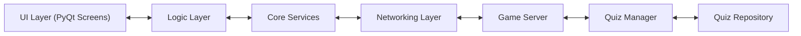
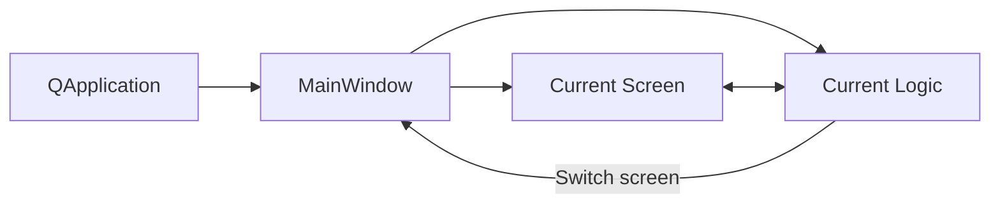

# Quiz Master - Architecture Overview

⚠️ This file is a work in progress!! ⚠️

## 1. Overview

This project is a client-server quiz application built with Python and PyQt6.  
It uses a layered architecture separating UI, logic, core services, and networking.

The system is designed around:

- A central server controlling game state.
- Lightweight clients rendering UI and sending input.
- A screen-based UI navigation system.
- A modular logic layer separating UI from business logic.

## 2. High-Level Architecture

The app can be split into layers. More information about each layer is present in Section 3.

- UI layer
- Logic layer
- Game logic layer
- Networking layer



## 3. Core Layers

### 3.1 UI Layer (`ui/`)

Responsible for rendering screens and handling user interaction.

At the root of the directory is the `main_window.py` file, responsible for rendering screens and running
navigation, as well as pairing screens with their respective logic and running lifecycles for each screen
(with `on_enter` and `on_leave`).

The `screens/` folder contains each screen as an individual file, split into `client`, `server`, or `common`.

The `components/` folder contains reuseable UI widgets, and the `assets/` folder contains images and other
multimedia files for the screens to use.

The UI layer doesn't contain any complex logic (only basic validation or UI manipulation), or any direct network
calls. It only communicates to the logic indirectly, via PyQt signals.

### 3.2 Logic Layer (`logic/`)

Handles application behavior and screen flow. Acts as the bridge between UI and game logic/networking.

Each logic file is paired with a respective UI file. A logic file has access to all services (`GameClient`
and `GameServer`) and ONLY its respective screen. It can switch to other screens with an optional payload
if needed, through the screen.

The logic layer is responsible for handling screen transitions, handling UI events, and listening to events from core services such as networking.

### 3.3 Core Services (`core/`)

Contains the main application backend logic. Handles game state in `game/quiz_manager.py`, server and client runtime and networking logic in the `services/` folder, and low-level networking in `services/networking/`.

The root `models/` folder (not in `core/`) contains representations of entities in the logic, such as a Player or a Quiz.

### 3.4 Data Layer (`data/`)

Manages quiz storage and persistent data.

## 4. Screen System



## 5. Networking Protocol

When communicating between the server and the client, a message must only contain two root keys: `type` and optionally `data`.
All other information should be in the `data` key. The `type` key must use a definition from the transport types protocol.

Example of data transfer:

```json
{
  "type": "join_lobby",
  "data": {
    "player_id": "bb4c6faa",
    "nickname": "Player 1"
  }
}
```
