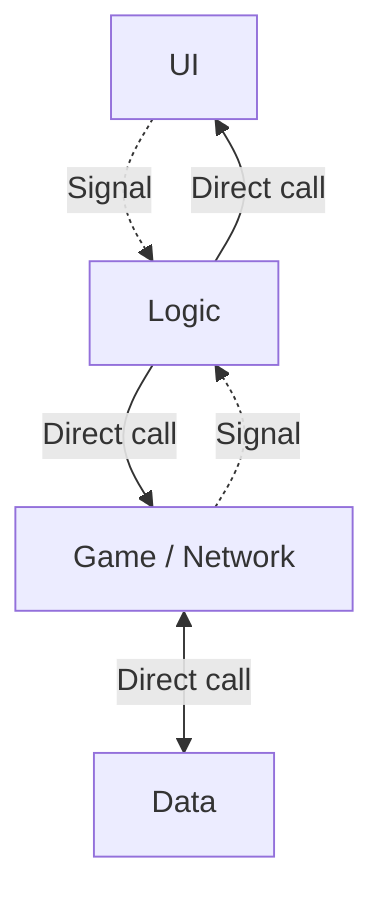
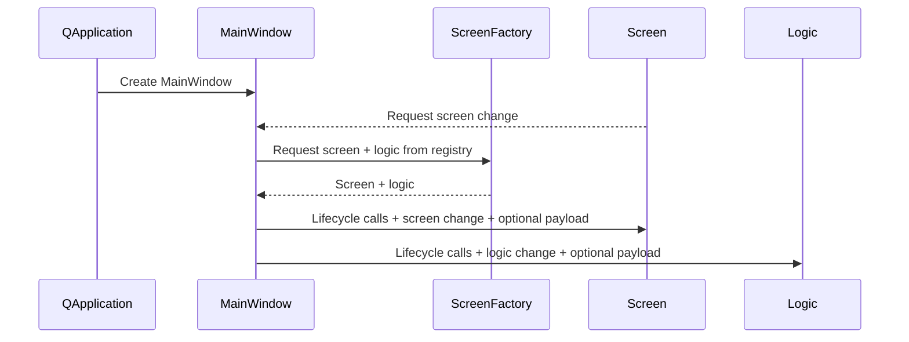
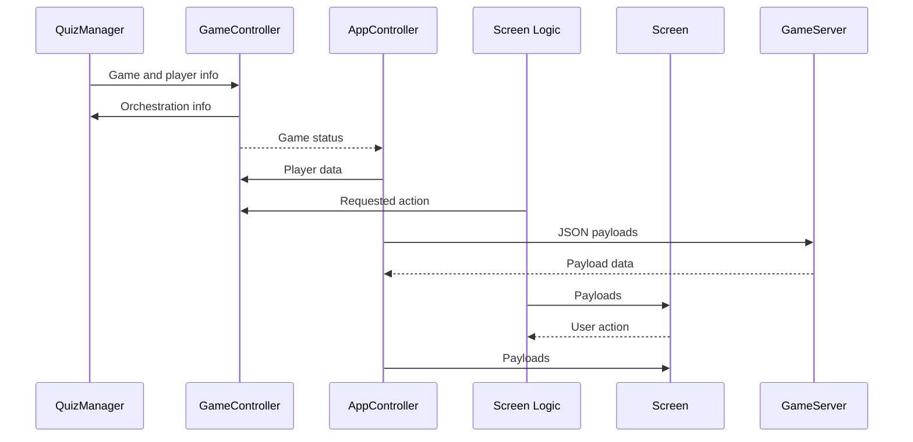

# Quiz Master - Architecture Overview

⚠️ This file is a work in progress! ⚠️

If you are in VS Code, press Ctrl+Shift+V for easier reading!

Note: Throughout the document, in diagrams, dotted lines are PyQt signals that the receiving
end listens to, and solid lines are direct method calls.

## 1. Overview

This project is a client-server quiz application built with Python and PyQt6,
using a layered architecture to allow for separation of concerns.

The program contains:

- A central server controlling game state.
- Lightweight clients rendering UI and sending input.
- A screen-based UI navigation system.
- A modular logic layer separating UI from game logic.

## 2. High-Level Architecture

The app can be split into four main layers. More information about each layer is present in Section 3.

- UI layer
- Logic layer
- Game logic and networking layer
- Data storage layer

The layers communicate to each other using either `pyqtSignal` or direct function calls. The way the layers
interact is shown below. Signals are typically used to decouple the layer from knowing about other layers,
however, the logic layer is the "glue" between the UI and game/networking layer, and thus can know about both
and do direct function calls.


```mermaid
flowchart TD
    UI[UI]
    Logic[Logic]
    Game[Game / Network]
    Data[Data]

    UI -. Signal .-> Logic
    Logic -- Direct call --> UI

    Game -. Signal .-> Logic
    Logic -- Direct call --> Game

    Game <-- Direct call --> Data
```

## 3. Core Layers

### 3.1 UI Layer (`ui/`)

Responsible for rendering screens and handling user interaction.

At the root of the directory is the `main_window.py` file, responsible for rendering screens and running
navigation, as well as pairing screens with their respective logic and running lifecycle for each screen
(with `on_enter` and `on_leave`).

The `screens/` folder contains each screen as an individual file, split into `client`, `server`, or `common`.

The `components/` folder contains reuseable UI widgets, and the `assets/` folder contains images and other
multimedia files for the screens to use.

The UI layer doesn't contain any complex logic (only basic validation or UI manipulation), or any direct network
calls. It only communicates to the logic indirectly, via PyQt signals.

### 3.2 Logic Layer (`logic/`)

Handles application behavior and screen flow. Acts as the bridge between UI and game logic/networking.

Each logic file is paired with a respective UI file. A logic file has access to all services (`GameClient`
and `GameServer`) and ONLY its respective screen. It can switch to other screens with an optional payload
if needed, through the screen.

The logic layer is responsible for handling screen transitions, handling UI events, and listening to events
from core services such as networking.

### 3.3 Core Services (`core/`)

Contains the main application backend logic. Handles game state in `game/quiz_manager.py`, server and client
runtime and networking logic in the `services/` folder, and low-level networking in `services/networking/`.

The root `models/` folder (not in `core/`) contains representations of entities in the logic, such as a Player or a Quiz.

### 3.4 Data Layer (`data/`)

Manages quiz storage and persistent data.

### 3.5 Data Layer (`models/`)

Contains data representations used throughout the app. Models do not contain UI behavior or networking logic.

## 4. Screen System

The screen system is controlled by the MainWindow, which is controlled by the QApplication (a core component of PyQt).

Each screen is connected with their respective logic file. The screens and logic are stored in their own registry entry
in `core/app/screen_factory.py`, allowing for easier scalability. When a screen requests to switch the screen from a
PyQt signal (allowing for separation of concerns), the MainWindow controls switching the screen UI and logic. It also runs
lifecycle functions for the screens and logic (`on_enter` and `on_leave`) for the screens and logic to run specific code.


```mermaid
sequenceDiagram
    participant App as QApplication
    participant Main as MainWindow
    participant Factory as ScreenFactory
    participant Screen
    participant Logic

    App->>Main: Create MainWindow

    Screen-->>Main: Request screen change
    Main->>Factory: Request screen + logic from registry
    Factory-->>Main: Screen + logic

    Main->>Screen: Lifecycle calls + screen change + optional payload
    Main->>Logic: Lifecycle calls + logic change + optional payload
```

## 5. Game Logic

### 5.1 Server-Side

Generally, the server-side's main responsibility is to run the game and be the final authority on game rules and
player state. For example, the server calculates the time it takes for a player to submit. The client does not send
the time it submitted at to prevent cheating, nor does the client calculate the points itself. The client sends the
bare minimum, and so does the server (e.g. the server does not send the correct answer until after the question is done).

The different components server-side related to the quiz game and their responsibilities are important to follow, to
ensure each component does not overreach and become tangled or a god class.


```mermaid
sequenceDiagram
    participant Manager as QuizManager
    participant Game as GameController
    participant AppController
    participant Logic as Screen Logic
    participant Screen
    participant Server as GameServer

    Manager->>Game: Game and player info
    Game->>Manager: Orchestration info

    Game-->>AppController: Game status
    AppController->>Game: Player data
    Logic->>Game: Requested action

    AppController->>Server: JSON payloads
    Server-->>AppController: Payload data

    Logic->>Screen: Payloads
    Screen-->>Logic: User action
    AppController->>Screen: Payloads
```

#### QuizManager

The "brain" of the quiz. It knows how the quiz works and manages players as well as the leaderboard, but does not know
how or when to run the quiz, which is done by `GameController`.

- **Does...**
  - Store and manage the active quiz and all active players.
  - Calculate points and other game statistics.
  - Provide data and calculations through APIs.
  - Generate payloads for result and question data.

- **Does not...**
  - Run the game lifecycle itself.
  - Handle networking or UI state.

#### GameController

Controls the game flow and acts as the orchestrator, but does not own game data or perform detailed calculations (these
are delegated to `QuizManager`).

- **Does...**
  - Orchestrate the overall flow of the quiz game, including timers and progression.
  - Coordinate `QuizManager` directly and the other components indirectly via signals.
  - Validate and process player answers.

- **Does not...**
  - Store or manage quiz/question data.
  - Calculate scores or leaderboard positioning.
  - Manage player data directly.
  - Handle the UI or networking communication.

#### GameServer

Acts as the communication layer between clients and the server. Transfers data from the client to the higher-up layers
server-side, and sends data to clients. It does not determine how the quiz works.

- **Does...**
  - Start, stop, and manage the game's TCP server and connections.
  - Handle player and client management, including joining, leaving, and validation.
  - Receive, validate, and process client messages, and send messages to clients.
  - Monitor client connectivity and disconnect them in case of protocol errors or unresponsiveness.

- **Does not...**
  - Implement game rules or game logic.
  - Manage the GUI or direct user interactions.

#### AppController

Acts as a communication layer between the `GameController`, `GameServer`, and UI screens, but does not make decisions about
how the game itself runs or works.

- **Does...**
  - Act like a bridge between `GameController`, `GameServer`, and the server UI.
  - Handle events from the server, such as players leaving, and sends that information to the controller.
  - Send game updates to clients through `GameServer`.
  - Control screen navigation when certain events occur.

- **Does not...**
  - Store or manage quiz/question data.
  - Control the game flow or timing.
  - Calculate scores, leaderboards, or store player information.
  - Validate answers or apply game rules.

## 6. Networking Protocol

When communicating between the server and the client, a message must only contain at most two root keys: `type` and optionally `data`.
All other information should be in the `data` key. The `type` key must use a definition from the transport types protocol.

Example of data transfer:

```json
{
  "type": "join_lobby",
  "data": {
    "nickname": "Player 1"
  }
}
```

The app follows a server-authoritative design, where clients are untrusted by default and the server is the only source of truth.
